Devir Bordado é um laboratório de pesquisa independente que usa como primeira linguagem o bordado para investigar a memória e a materialidade na produção de conhecimento. A partir dessa investigação, documenta processos, produz conhecimento e compartilha experimentos e publicações em um acervo público.

Devir Bordado is an independent research laboratory that uses embroidery as its primary language to investigate memory and materiality in the production of knowledge. Based on this investigation, it documents processes, generates knowledge, and shares experiments and publications in a public archive.

---

- 🌐 [devirbordado.space](https://devirbordado.space) — em gestação/in the making
- 📚 Acervo público/Public collection — em breve/soon
- ✉️ contato@devirbordado.space
